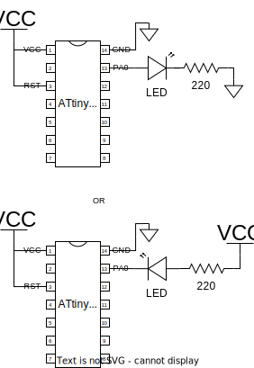

# Blink
**Target Device :** ATtiny84A
**Target Language :** Assembly

## Description
Simple program to blink an LED. The blink delay is not precisely calculated and it is just made long enough to observe the blink at about 1 - 2MHz clock speed.

## Connection

The resistor can be varied to adjust the brightness of the LED, but should make sure not to exceed the maximum current limit of the LED (usually ~20mA).
