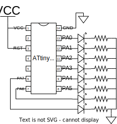

# LED Chaser
**Target Device :** ATtiny84A

**Target Language :** Assembly

## Description
LED Chaser circuit. 8 LEDs are connected to PortA and they are turned on one by one in a sequence. The delay is not precisely calculated and it is just made long enough to observe the blink at about 1 - 2MHz clock speed.
The Rotate Left instruction `ROL` can be changed to Rotate Right `ROR` to change the direction.

## Connection

The resistor can be varied to adjust the brightness of the LED, but should make sure not to exceed the maximum current limit of the LED (usually ~20mA).
