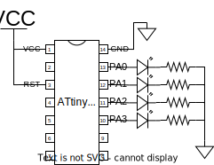

# LED Pattern 1
**Target Device :** ATtiny84A

**Target Language :** Assembly

## Description
4 LEDs are connected to PortA and they are turned on in sequence and the sequence reverses. The delay is not precisely calculated and it is just made long enough to observe the blink at about 1 - 2MHz clock speed.

This circuit demonstrates the usage of flags and conditional jumps.

## Connection

The resistor can be varied to adjust the brightness of the LED, but should make sure not to exceed the maximum current limit of the LED (usually ~20mA).
